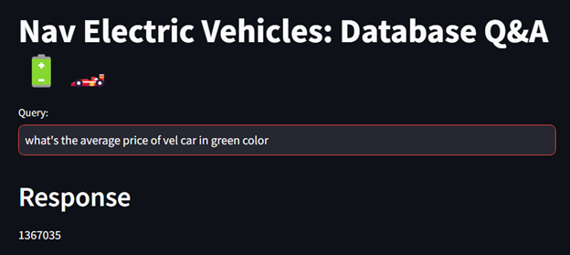

# Electric-Vehicle-DB-Query-Response-with-PaLM-and-Langchain
Web App developed to query the SQL Database which stores Electric vehicle information using PaLM LLM with Langchain tools for prompt engineering

# Nav EV Cars: Query to a Database  

This is an end to end LLM project based on Google Palm and Langchain. We are building a system that can talk to MySQL database. 
User asks questions in a natural language and the system generates answers by converting those questions to an SQL query and
then executing that query on MySQL database. 
Nav EV Cars is a EV Cars showroom where they maintain their inventory, sales and discounts data in Microsoft SQL database. A store manager 
will may ask questions such as,
- How many white color Adidas t shirts do we have left in the stock?
- How much sales our store will generate if we can sell all extra-small size t shirts after applying discounts?
The system is intelligent enough to generate accurate queries for given question and execute them on MySQL database



## Project Highlights

- Nav EV is a multi brand car showroom that sells Tesla 'Tesla', 'Tata', 'Mahindra', 'Vel', 'Ford', 'Amigo' electric cars
- Their inventory, sales and discounts data is stored in a MySQL database
- We will build an LLM based question and answer system that will use following,
  - Google Palm LLM
  - Hugging face embeddings
  - Streamlit for UI
  - Langchain framework
  - FAISS as a vector store
  - Few shot learning
- In the UI, store manager will ask questions in a natural language and it will produce the answers


## Installation

1.Clone this repository to your local machine using:

```bash
  git clone https://github.com/naveentnj/Electric-Vehicle-DB-Query-Response-with-PaLM-and-Langchain.git
```
2.Navigate to the project directory:

2. Install the required dependencies using pip:

```bash
  pip install -r requirements.txt
```
3.Acquire an api key through makersuite.google.com and put it in .env file

```bash
  GOOGLE_API_KEY="your_api_key_here"
```
4. For database setup, run database/db_creation_atliq_t_shirts.sql in your MySQL workbench

## Usage

1. Run the Streamlit app by executing:
```bash
streamlit run main.py

```

2.The web app will open in your browser where you can ask questions

## Sample Questions
  - How many ev_cars do we have left for Tata in premium_customized model and white color??
  - How much is the total price of the inventory for all base-model evcars?
  - How much sales amount will be generated if we sell all small size adidas shirts today after discounts?
  
## Project Structure

- main.py: The main Streamlit application script.
- langchain_helper.py: This has all the langchain code
- requirements.txt: A list of required Python packages for the project.
- few_shots.py: Contains few shot prompts
- .env: Configuration file for storing your Google API key.
